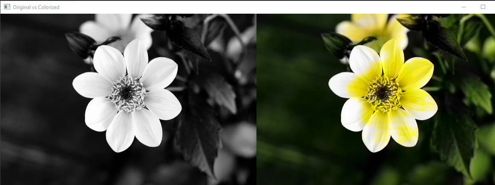
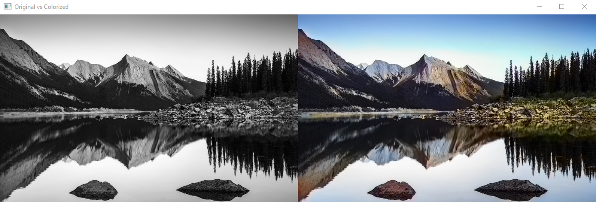

# Colorize
# Colorizing Images with AI and Computer Vision

This project showcases the use of artificial intelligence for colorizing images, transforming black-and-white photos into vibrant representations. By employing advanced algorithms, the app analyzes grayscale images and predicts realistic colors based on learned features from extensive datasets. The applications of this technology are vast, impacting industries like media, art, and historical preservation.

## About the App

I developed this app using pre-trained models:
- `colorization_deploy_v2.prototxt`
- `colorization_release_v2.caffemodel`
- `pts_in_hull.npy`

Through this project, I gained valuable insights into the intersection of AI and computer vision, conducting experiments that enhanced my understanding of image colorization techniques. I look forward to exploring more AI applications that leverage computer vision to create innovative solutions.
you can find the models here : 
- [prototxt](https://github.com/SalimMessaad1/Colorize/blob/main/colorization_deploy_v2.prototxt)
- [caffemodel](https://huggingface.co/spaces/viveknarayan/Image_Colorization/blob/main/colorization_release_v2.caffemodel)
- [hull.npy](https://huggingface.co/spaces/viveknarayan/Image_Colorization/blob/main/pts_in_hull.npy)

# Results 

## First one 

## Second one  

